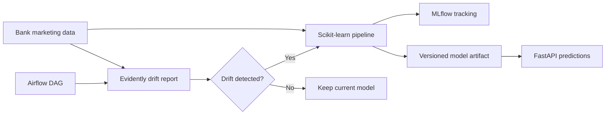

# End-to-End MLOps Drift Detection Pipeline

[](https://github.com/amachicielo/End-to-end-MLOps-Drift-Detection-Pipeline/actions/workflows/ci.yml)

A reproducible MLOps reference project that trains a bank-marketing classifier, tracks experiments, serves predictions, monitors data drift, and orchestrates recurring checks.

> **Status:** portfolio-grade local reference architecture. It demonstrates production patterns, but it is not presented as a managed production service.

## Architecture



## Implemented capabilities

- Mixed numeric and categorical preprocessing with unknown-category handling
- Reproducible random-forest training and stratified evaluation
- Accuracy, F1, and ROC AUC metrics logged to MLflow
- Model bundle containing the complete preprocessing and inference pipeline
- FastAPI health and prediction endpoints
- Column-level drift reports with Evidently
- Airflow scheduling for monitoring and conditional retraining
- Docker Compose environments and automated CI tests

## Project structure

```text
api/                    FastAPI application
src/training/           Training and model packaging
src/drift_detection/    Evidently monitoring
airflow/dags/           Scheduled monitoring workflow
tests/                  API and training tests
data/                   Bank marketing dataset
docker-compose.yml      API and MLflow stack
docker-compose.airflow.yml  Extended Airflow stack
```

Generated MLflow runs, model binaries, Python caches, and HTML reports are intentionally ignored. CI or local runs should recreate them.

## Quick start

### 1. Create the model

```bash
python -m pip install -r requirements.txt
python src/training/train_model.py
```

### 2. Start the API and MLflow

```bash
docker compose up --build
```

- API documentation: <http://localhost:8000/docs>
- Health check: <http://localhost:8000/health>
- MLflow: <http://localhost:5000>

### 3. Request a prediction

```bash
curl -X POST http://localhost:8000/predict \
  -H "Content-Type: application/json" \
  -d '{
    "age": 35,
    "job": "technician",
    "marital": "married",
    "education": "secondary",
    "default": "no",
    "housing": "yes",
    "loan": "no",
    "contact": "cellular",
    "month": "may",
    "day_of_week": "mon",
    "duration": 150,
    "campaign": 1,
    "pdays": 999,
    "previous": 0,
    "poutcome": "nonexistent",
    "emp.var.rate": 1.1,
    "cons.price.idx": 93.994,
    "cons.conf.idx": -36.4,
    "euribor3m": 4.857,
    "nr.employed": 5191
  }'
```

## Drift monitoring

Generate a report manually:

```bash
python src/drift_detection/monitor_drift.py
```

For scheduled monitoring, start the extended stack:

```bash
docker compose -f docker-compose.airflow.yml up --build
```

The Airflow DAG runs drift monitoring daily and invokes retraining only when the selected columns report drift.

## Tests

```bash
python -m pytest -q
```

The API tests use FastAPI's in-process test client; they do not require a manually started server.

## Limitations

- The drift split is a deterministic demonstration, not a live production stream.
- Retraining needs approval gates, model comparison, and deployment promotion before production use.
- Default local credentials in the Airflow Compose file must be replaced outside a development machine.

## Author

John G. Amachi Cielo — MLOps / Data Engineering portfolio project
